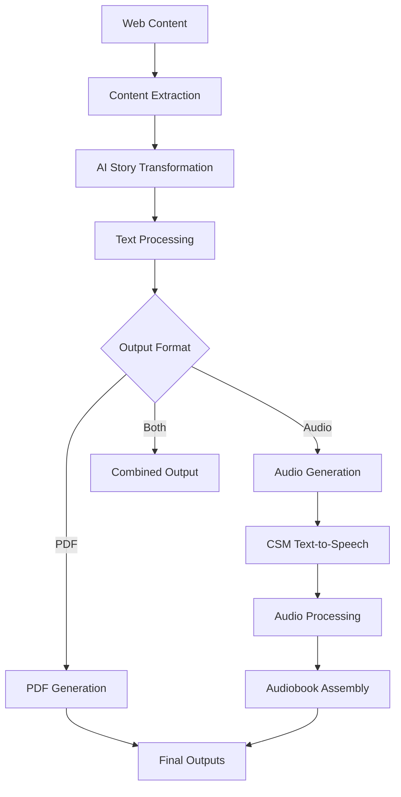

# CSM Voice Mode Implementation Plan
## Integrating Sesame CSM for Audiobook Generation

### 🎯 **Project Overview**
Transform the existing Whimperizer content pipeline to support audiobook generation using Sesame CSM (Conversational Speech Model). This will convert generated Wimpy Kid-style stories into high-quality audio narratives.

---

## 📋 **Current System Analysis**

### **Existing Architecture**
- **Content Pipeline**: `src/pipeline.py` orchestrates web scraping → AI transformation → PDF generation
- **Content Storage**: Stories stored in `output/whimperized_content/`
- **Output Format**: Currently generates PDFs in Wimpy Kid style
- **Dependencies**: OpenAI/Anthropic for text transformation, basic Python libraries

### **System Capabilities**
- ✅ Web content extraction and processing
- ✅ AI-powered story transformation
- ✅ PDF generation with custom styling
- ❌ **Missing**: Audio generation capabilities

---

## 🏗️ **Implementation Architecture**

### **Phase 1: Infrastructure Setup**

#### **1.1 Environment Requirements**
```yaml
System Requirements:
  - Python: 3.10-3.12 (Current: 3.13.3 - needs downgrade)
  - GPU: CUDA-compatible (Not available - CPU fallback required)
  - Memory: 8GB+ RAM recommended for 1B model
  - Storage: 3-5GB for model weights
  - Audio: ffmpeg for audio processing
```

#### **1.2 DevOps Implications**
```yaml
Infrastructure Changes:
  - Docker container updates for Python 3.10/3.12
  - Additional storage for model weights (~3GB)
  - Audio processing dependencies (ffmpeg, sox)
  - GPU support (optional, for production acceleration)
  - Increased memory allocation for model inference
```

#### **1.3 Dependency Management**
```yaml
New Dependencies:
  - torch>=2.4.0 (PyTorch ecosystem)
  - torchaudio>=2.4.0 (Audio processing)
  - transformers>=4.49.0 (Hugging Face models)
  - huggingface_hub>=0.28.1 (Model downloads)
  - moshi>=0.2.2 (Audio codecs)
  - Additional audio libs: audiofile, resampy
```

---

### **Phase 2: Core Integration**

#### **2.1 New Module Structure**
```
src/
├── audio/                          # New audio generation module
│   ├── __init__.py
│   ├── csm_generator.py           # Core CSM wrapper
│   ├── audio_processor.py         # Audio utilities
│   ├── voice_manager.py           # Speaker/voice management
│   └── audiobook_generator.py     # High-level audiobook creation
├── pipeline.py                    # Updated to include audio generation
└── ... (existing modules)

config/
├── csm_requirements.txt           # CSM-specific dependencies
├── audio_config.yaml             # Audio generation settings
└── ... (existing configs)

output/
├── audiobooks/                    # New audio output directory
│   ├── wav/                       # Raw audio files
│   ├── mp3/                       # Compressed audio
│   └── metadata/                  # Audio metadata
└── ... (existing outputs)
```

#### **2.2 Core Components**

##### **CSM Generator Module** (`src/audio/csm_generator.py`)
```python
Features:
  - CSM model initialization and management
  - Text-to-speech conversion
  - Context-aware generation for conversations
  - Speaker voice management
  - Batch processing for long content
  - Error handling and fallbacks
```

##### **Audio Processor** (`src/audio/audio_processor.py`)
```python
Features:
  - Audio format conversion (WAV → MP3)
  - Audio concatenation for chapters
  - Silence padding and audio transitions
  - Volume normalization
  - Audio quality optimization
```

##### **Voice Manager** (`src/audio/voice_manager.py`)
```python
Features:
  - Multiple speaker voices for characters
  - Voice consistency across chapters
  - Narrator voice configuration
  - Character voice mapping
  - Voice sample management
```

---

### **Phase 3: Pipeline Integration**

#### **3.1 Updated Pipeline Flow**


#### **3.2 Configuration Updates**
```yaml
# config/audio_config.yaml
audio:
  enabled: true
  model:
    name: "sesame/csm-1b"
    device: "cpu"  # "cuda" if available
    precision: "float32"
  output:
    format: ["wav", "mp3"]
    sample_rate: 24000
    channels: 1
  voices:
    narrator: 0
    greg: 1
    rodrick: 2
    mom: 3
    dad: 4
  processing:
    max_chunk_length_ms: 10000
    silence_padding_ms: 500
    normalize_volume: true
```

---

### **Phase 4: Implementation Strategy**

#### **4.1 Development Phases**

##### **Phase 4.1: Foundation (Week 1)**
```yaml
Tasks:
  - Environment setup and Python version management
  - CSM dependencies installation
  - Basic CSM model integration
  - Simple text-to-speech proof of concept
Deliverables:
  - Working CSM setup
  - Basic audio generation script
  - Environment configuration
```

##### **Phase 4.2: Core Features (Week 2)**
```yaml
Tasks:
  - Implement CSM generator module
  - Audio processing utilities
  - Voice management system
  - Pipeline integration framework
Deliverables:
  - Complete audio generation module
  - Integration with existing pipeline
  - Voice configuration system
```

##### **Phase 4.3: Advanced Features (Week 3)**
```yaml
Tasks:
  - Multi-speaker voice support
  - Chapter-based audio generation
  - Audio quality optimization
  - Error handling and recovery
Deliverables:
  - Full audiobook generation
  - Quality audio output
  - Robust error handling
```

##### **Phase 4.4: Production Ready (Week 4)**
```yaml
Tasks:
  - Performance optimization
  - Memory management
  - Testing and validation
  - Documentation and deployment
Deliverables:
  - Production-ready system
  - Complete documentation
  - Deployment configurations
```

---

### **Phase 5: Technical Challenges & Solutions**

#### **5.1 Hardware Limitations**
```yaml
Challenge: No GPU available (CPU-only inference)
Solutions:
  - Use quantized models for faster inference
  - Implement streaming generation for memory efficiency
  - Add model caching and optimization
  - Consider cloud GPU integration for production
```

#### **5.2 Python Version Compatibility**
```yaml
Challenge: Current Python 3.13.3, CSM requires 3.10-3.12
Solutions:
  - Use pyenv for Python version management
  - Docker container with Python 3.10/3.12
  - Virtual environment isolation
  - CI/CD pipeline updates
```

#### **5.3 Model Size and Performance**
```yaml
Challenge: 1B parameter model (~3GB) on limited resources
Solutions:
  - Model quantization (4-bit/8-bit)
  - Lazy loading and model caching
  - Chunk processing for long content
  - Progressive audio generation
```

#### **5.4 Audio Quality vs Speed**
```yaml
Challenge: Balance between audio quality and generation speed
Solutions:
  - Configurable quality settings
  - Streaming generation for real-time feedback
  - Background processing for batch jobs
  - Audio compression optimization
```

---

### **Phase 6: Integration Points**

#### **6.1 Pipeline Integration**
```python
# Updated src/pipeline.py
class WhimperizerPipeline:
    def __init__(self, config):
        self.config = config
        self.audio_enabled = config.get('audio', {}).get('enabled', False)
        if self.audio_enabled:
            from audio.audiobook_generator import AudiobookGenerator
            self.audio_generator = AudiobookGenerator(config)
    
    def process_content(self, content):
        # Existing PDF generation
        pdf_path = self.generate_pdf(content)
        
        # New audio generation
        if self.audio_enabled:
            audio_path = self.audio_generator.generate_audiobook(content)
            return {'pdf': pdf_path, 'audio': audio_path}
        
        return {'pdf': pdf_path}
```

#### **6.2 Story Structure Analysis**
```yaml
Text Processing Enhancements:
  - Character dialogue extraction
  - Narrator text identification
  - Chapter/section detection
  - Speaker assignment automation
  - Emotion/tone analysis for voice modulation
```

---

### **Phase 7: DevOps and Deployment**

#### **7.1 Container Updates**
```dockerfile
# Enhanced Dockerfile
FROM python:3.10-slim

# Install system dependencies
RUN apt-get update && apt-get install -y \
    ffmpeg \
    sox \
    libsndfile1 \
    && rm -rf /var/lib/apt/lists/*

# Install Python dependencies
COPY config/csm_requirements.txt .
RUN pip install -r csm_requirements.txt

# Configure environment
ENV PYTHONPATH=/app/src
ENV TORCH_COMPILE=0
ENV NO_TORCH_COMPILE=1
```

#### **7.2 Resource Management**
```yaml
Memory Management:
  - Model loading strategies
  - Garbage collection optimization
  - Memory monitoring and alerts
  - Graceful degradation on low memory

Storage Management:
  - Model weight caching
  - Audio output compression
  - Cleanup strategies for temporary files
  - Cloud storage integration
```

#### **7.3 Monitoring and Logging**
```yaml
Audio Generation Metrics:
  - Processing time per chapter
  - Audio quality metrics
  - Memory usage tracking
  - Error rates and recovery
  - User experience metrics
```

---

### **Phase 8: Testing Strategy**

#### **8.1 Unit Tests**
```yaml
Test Coverage:
  - CSM model initialization
  - Audio generation functionality
  - Voice management
  - Audio processing utilities
  - Error handling scenarios
```

#### **8.2 Integration Tests**
```yaml
End-to-End Testing:
  - Complete pipeline with audio
  - Multi-format output generation
  - Performance benchmarks
  - Quality assessment
  - User acceptance testing
```

#### **8.3 Performance Tests**
```yaml
Benchmarking:
  - Generation speed vs content length
  - Memory usage patterns
  - Audio quality metrics
  - CPU utilization optimization
  - Concurrent processing capabilities
```

---

### **Phase 9: Future Enhancements**

#### **9.1 Advanced Features**
```yaml
Voice Cloning:
  - Custom voice training
  - Character voice consistency
  - Emotional expression control
  - Background music integration

Interactive Features:
  - Chapter navigation
  - Playback speed control
  - Voice preference selection
  - Accessibility features
```

#### **9.2 Scalability**
```yaml
Cloud Integration:
  - GPU acceleration in cloud
  - Distributed processing
  - API service deployment
  - Auto-scaling capabilities
```

---

## 🚀 **Implementation Roadmap**

### **Immediate Actions (Next 24 Hours)**
1. ✅ **Environment Assessment** - Completed
2. 🔄 **Python Version Setup** - Use pyenv or Docker
3. 🔄 **CSM Dependencies Installation** - Install requirements
4. 🔄 **Basic CSM Test** - Verify model loading

### **Week 1: Foundation**
- Environment setup and model integration
- Basic audio generation capabilities
- Pipeline integration framework

### **Week 2-3: Core Development**
- Full feature implementation
- Multi-speaker support
- Quality optimization

### **Week 4: Production Ready**
- Testing, documentation, deployment
- Performance optimization
- Monitoring setup

---

## 💡 **Key Success Factors**

1. **Incremental Development**: Build and test in small increments
2. **Resource Management**: Careful handling of CPU-only constraints
3. **Quality First**: Prioritize audio quality over speed initially
4. **User Experience**: Seamless integration with existing workflow
5. **Scalability**: Design for future GPU acceleration and cloud deployment

---

## 📊 **Expected Outcomes**

### **Technical Results**
- High-quality audiobook generation from text content
- Multi-speaker voice support for character dialogues
- Seamless integration with existing PDF pipeline
- Efficient CPU-based inference with optimization

### **User Benefits**
- Enhanced accessibility through audio format
- Immersive storytelling experience
- Multiple output format options
- Automated audiobook creation from web content

### **Business Impact**
- Expanded content format offerings
- Improved user engagement
- Accessibility compliance
- Competitive advantage in content transformation

---

*This implementation plan provides a comprehensive roadmap for integrating CSM voice capabilities into your Whimperizer project, considering current constraints and future scalability.*