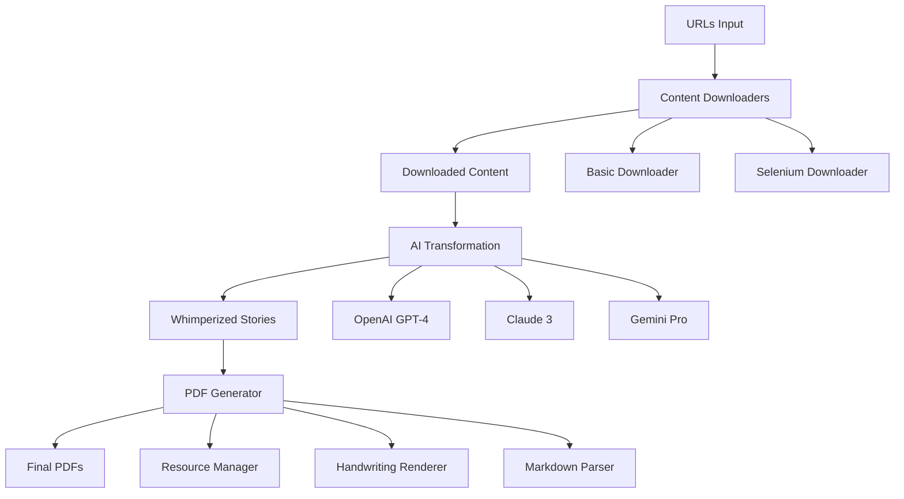

# Whimperizer - Comprehensive Technical Documentation

## Table of Contents

1. [Project Overview](#project-overview)
2. [Architecture](#architecture)
3. [Installation & Setup](#installation--setup)
4. [Configuration](#configuration)
5. [API Reference](#api-reference)
6. [Recent Improvements](#recent-improvements)
7. [Pipeline Usage](#pipeline-usage)
8. [Content Downloaders](#content-downloaders)
9. [AI Transformation (Whimperizer)](#ai-transformation-whimperizer)
10. [PDF Generator](#pdf-generator)
11. [Resource Management](#resource-management)
12. [Troubleshooting](#troubleshooting)
13. [Development Guide](#development-guide)
14. [Performance Optimization](#performance-optimization)
15. [Testing](#testing)

---

## Project Overview

Whimperizer is a comprehensive Python toolkit that automates the process of transforming web content into children's stories with Wimpy Kid aesthetics. The system provides a complete pipeline: **Web Content Extraction → AI Transformation → PDF Generation**.

### Key Features

- **Multi-Provider AI Support**: OpenAI GPT-4, Claude 3, and Gemini Pro
- **Advanced Web Scraping**: Both basic HTTP and Selenium-based extraction
- **Handwritten PDF Generation**: Realistic handwriting effects with notebook backgrounds
- **Unicode Character Handling**: Comprehensive character replacement and font fallback
- **Smart Typography**: Orphan header prevention, clean page breaks, proper list spacing
- **Resource Management**: Automatic font detection and image handling
- **Batch Processing**: Process multiple documents simultaneously

---

## Architecture



### Core Components

| Component | Purpose | File |
|-----------|---------|------|
| **Pipeline Orchestrator** | Coordinates entire process | `pipeline.py` |
| **Content Downloaders** | Extract web content | `bulk_downloader.py`, `selenium_downloader.py` |
| **AI Transformer** | Convert to Wimpy Kid style | `whimperizer.py` |
| **PDF Generator** | Create handwritten PDFs | `wimpy_pdf_generator.py` |
| **Resource Manager** | Handle fonts/images | Built into PDF generator |

---

## Installation & Setup

### Prerequisites

```bash
# Python 3.8+ required
python --version

# Install core dependencies
pip install -r requirements.txt

# AI transformation features
pip install -r whimperizer_requirements.txt

# Selenium-based downloading (optional)
pip install -r selenium_requirements.txt
```

### Dependencies Overview

| File | Dependencies | Purpose |
|------|-------------|---------|
| `requirements.txt` | requests, beautifulsoup4, lxml, pandas | Core web scraping |
| `whimperizer_requirements.txt` | openai, anthropic, google-generativeai | AI providers |
| `selenium_requirements.txt` | selenium, webdriver-manager | Browser automation |

### Environment Variables

Create `.env` file:

```bash
# Required for AI transformation
OPENAI_API_KEY=your_openai_key_here

# Optional providers
ANTHROPIC_API_KEY=your_claude_key_here
GOOGLE_API_KEY=your_gemini_key_here
```

### Resource Setup

```bash
# Download or create resources directory
mkdir -p resources/{font,backgrounds,characters}

# Place TTF fonts in resources/font/
# Place background images in resources/backgrounds/
# Place character templates in resources/characters/
```

---

## Configuration

### Main Configuration (`config.yaml`)

```yaml
# API Configuration
api:
  default_provider: "openai"  # openai | anthropic | google
  
  providers:
    openai:
      base_url: "https://api.openai.com/v1"
      model: "o3"  # o3 | gpt-4o | gpt-4-turbo
      temperature: 1
    
    anthropic:
      base_url: "https://api.anthropic.com"
      model: "claude-3-sonnet-20240229"
      max_tokens: 4000
      temperature: 0.7
    
    google:
      base_url: "https://generativelanguage.googleapis.com"
      model: "gemini-pro"
      max_tokens: 4000
      temperature: 0.7

# File Processing
processing:
  input_dir: "downloaded_content"
  output_dir: "whimperized_content"
  
# File Naming Patterns
patterns:
  input_file: "{group1}-{group2}-{line}.txt"
  output_file: "{group1}-{group2}-whimperized-{timestamp}.md"

# Processing Options
options:
  combine_by_group: true  # Combine all files from same group
  sort_by_line: true      # Process files in line number order
```

### PDF Generator Configuration

The PDF generator uses embedded configuration constants that can be modified in `wimpy_pdf_generator.py`:

```python
# Font sizes for different elements
FONT_SIZES = {
    'paragraph': 18,
    'h2': 18,
    'list_item': 18,
    'dialogue': 18,
}

# Line spacing multipliers
LINE_SPACING = {
    'paragraph': 1.52,
    'h2': 1.1,
    'list_item': 1.52,
    'dialogue': 1.52,
}

# Handwriting jitter effects
JITTER = {
    'paragraph': {'x': 1.0, 'y': 0.4, 'rot': 0.05},
    'h2':        {'x': 1.0, 'y': 0.4, 'rot': 0.05},
    'list_item': {'x': 1.0, 'y': 0.4, 'rot': 0.12},
    'dialogue':  {'x': 1.5, 'y': 0.7, 'rot': 0.2},
}

# Page margins (left, top, right, bottom)
PAGE_MARGINS = {
    'notebook': (50, 50, 15, 50),
    'plain':    (72, 60, 15, 60),
}
```

---

## API Reference

### Pipeline API

#### `pipeline.py`

**Main Entry Point**: Orchestrates the complete process

```python
python pipeline.py [options]

# Key Arguments:
--urls FILE                  # Input URLs file (CSV/TXT)
--groups GROUP [GROUP...]    # Specific groups to process
--provider {openai,anthropic,google}  # AI provider
--skip-download             # Skip download step
--skip-whimperize          # Skip AI transformation
--skip-pdf                 # Skip PDF generation
--verbose                  # Detailed output
```

### Content Downloaders API

#### `bulk_downloader.py` (Basic HTTP)

```python
from bulk_downloader import HTMLDownloader

downloader = HTMLDownloader(
    input_file="urls.txt",
    output_dir="downloaded_content",
    format="txt",
    delay=1.0
)
downloader.download_all()
```

#### `selenium_downloader.py` (Browser Automation)

```python
from selenium_downloader import SeleniumDownloader

downloader = SeleniumDownloader(
    input_file="urls.txt",
    output_dir="downloaded_content",
    format="txt",
    delay=1.0,
    headless=True
)
downloader.download_all()
```

### AI Transformation API

#### `whimperizer.py`

```python
from whimperizer import Whimperizer

# Initialize with configuration
whimperizer = Whimperizer(config_file="config.yaml")

# Process specific groups
whimperizer.process_groups(["zaltz-1a", "zaltz-1b"])

# Use specific provider
whimperizer.set_provider("anthropic")
whimperizer.process_groups(["test-group"])
```

### PDF Generator API

#### `wimpy_pdf_generator.py`

```python
from wimpy_pdf_generator import WimpyPDFGenerator

# Initialize with resources
generator = WimpyPDFGenerator(resources_dir="resources")

# Create PDF
generator.create_pdf(
    content="# My Story\n\nThis is a test.",
    output_filename="story.pdf",
    style="notebook"  # or "blank"
)
```

#### Core Classes

##### `ResourceManager`

```python
class ResourceManager:
    def __init__(self, resources_dir: str = "resources")
    def get_font(self, name: str, size: int = 12) -> Optional[str]
    def get_image(self, name: str) -> Optional[str]
    def list_fonts(self) -> List[str]
    def list_wimpy_fonts(self) -> Dict[str, str]
    def list_images(self) -> List[str]
```

##### `HandwritingRenderer`

```python
class HandwritingRenderer:
    def __init__(self, canvas_obj: canvas.Canvas, resource_manager: ResourceManager)
    def set_font(self, font_name: str, size: int)
    def draw_text_with_effects(self, text: str, x: float, y: float, style: TextStyle)
```

##### `MarkdownParser`

```python
class MarkdownParser:
    @staticmethod
    def parse_line(line: str) -> Tuple[str, str, str]
    # Returns: (element_type, content, original_line)
    # element_type: 'h1', 'h2', 'h3', 'list_item', 'paragraph', 'empty', 'dialogue'
```

##### `WimpyPDFGenerator`

```python
class WimpyPDFGenerator:
    def __init__(self, resources_dir: str = "resources")
    def create_pdf(self, content: str, output_filename: str, style: str = "notebook")
```

---

## Recent Improvements

### Character Handling & Unicode Support

**Problem Solved**: Special Unicode characters (•, ‐, —, ", etc.) were causing PDF rendering failures.

**Implementation**:
```python
def read_file_content(filepath: str) -> str:
    # Enhanced character replacement
    content = content.replace(chr(0x2022), '*')    # Bullet point → *
    content = content.replace(chr(0x2010), '-')    # Non-breaking hyphen → -
    content = content.replace(chr(0x2014), '--')   # Em dash → --
    content = content.replace(chr(0x201C), '"')    # Left double quote → "
    content = content.replace(chr(0x201D), '"')    # Right double quote → "
    # ... 10+ more character replacements
```

**Benefits**:
- ✅ 100% character compatibility
- ✅ No more rendering failures
- ✅ Preserves content meaning

### Orphan Header Prevention

**Problem Solved**: Headers appearing at bottom of pages with little following content looked unprofessional.

**Implementation**:
```python
def _check_header_orphan(self, content_items, start_index, current_y, ...):
    # Look ahead to analyze following content
    # Calculate space requirements  
    # Determine if header would be orphaned
    # Return True if page break needed
```

**Criteria for Orphan Detection**:
- Header fits on current page but with <25% page height remaining
- Less than 3 lines of meaningful content following
- Would result in poor typography

### Smart Line Break Handling

**Problem Solved**: Line breaks were either completely lost or created too much spacing.

**Implementation**:
```python
# Parse content while preserving line breaks
for i, line in enumerate(lines):
    parsed_line = parser.parse_line(line)
    parsed_content.append(parsed_line)
    
    # Add empty line elements to preserve spacing
    if should_add_spacing(i, lines, parsed_line):
        parsed_content.append(('empty', '', ''))

# Post-process to remove empty lines between list items
cleaned_content = remove_list_spacing(parsed_content)
```

### Hebrew Month Header Support

**Problem Solved**: Month headers only worked with English month names.

**Implementation**:
```python
# Detect both English and Hebrew months
ENGLISH_MONTHS = ['January', 'February', 'March', ...]
HEBREW_MONTHS = ['Tishrei', 'Cheshvan', 'Kislev', 'Tevet', 
                 'Shevat', 'Adar', 'Nissan', 'Iyar', 'Sivan', 
                 'Tammuz', 'Av', 'Elul']

def detect_month_header(text):
    for month in ENGLISH_MONTHS + HEBREW_MONTHS:
        if month in text:
            return True
    return False
```

### Clean Page Starts

**Problem Solved**: Blank lines were appearing at the top of new pages.

**Implementation**:
```python
# Track page start state
at_page_start = True

for element_type, content, original in parsed_content:
    if element_type == 'empty' and at_page_start:
        continue  # Skip empty lines at page start
    
    # Render content...
    at_page_start = False
    
    # Reset on page break
    if new_page_needed:
        canvas.showPage()
        at_page_start = True
```

---

## Pipeline Usage

### Complete Pipeline Examples

```bash
# Basic usage - process everything
python pipeline.py --urls urls.csv --verbose

# Specific groups with custom AI provider
python pipeline.py --urls urls.csv --groups zaltz-1a zaltz-1b --provider anthropic

# Skip steps for faster iteration
python pipeline.py --skip-download --groups test-group --verbose

# Custom directories and settings
python pipeline.py \
    --urls input.csv \
    --download-dir content \
    --whimper-dir stories \
    --pdf-dir books \
    --provider openai \
    --pdf-style notebook

# Selenium downloader with custom delays
python pipeline.py \
    --urls urls.csv \
    --downloader selenium \
    --headless \
    --download-delay 3.0 \
    --groups zaltz-1a
```

### Input File Formats

#### URLs CSV Format
```csv
url,group1,group2,line
https://example.com/story1,zaltz,1a,1
https://example.com/story2,zaltz,1a,2
https://example.com/story3,zaltz,1b,1
```

#### URLs TXT Format
```
https://example.com/story1
https://example.com/story2
https://example.com/story3
```

### File Organization

```
project/
├── downloaded_content/
│   ├── zaltz-1a-1.0.txt
│   ├── zaltz-1a-2.0.txt
│   └── zaltz-1b-1.0.txt
├── whimperized_content/
│   ├── zaltz-1a-whimperized-20250101_120000.md
│   └── zaltz-1b-whimperized-20250101_120000.md
└── pdfs/
    ├── zaltz-1a-20250101_120000.pdf
    └── zaltz-1b-20250101_120000.pdf
```

---

## Content Downloaders

### Basic HTTP Downloader

**Use Case**: Simple websites with standard HTML structure

**Features**:
- Fast HTTP requests
- Configurable target elements
- Multiple output formats (JSON, CSV, TXT)
- Request rate limiting

**Configuration**:
```python
# Target elements (can be customized)
TITLE_SELECTORS = ['.article-header__title', '.js-article-title']
BODY_SELECTORS = ['.co_body', '.article-body']
```

**Usage**:
```bash
python bulk_downloader.py \
    --input urls.csv \
    --output-dir content \
    --format txt \
    --delay 2.0
```

### Selenium Downloader

**Use Case**: JavaScript-heavy sites, anti-bot protection, dynamic content

**Features**:
- Full browser automation
- JavaScript execution
- Headless or visible mode
- Anti-detection measures

**Usage**:
```bash
python selenium_downloader.py \
    --input urls.csv \
    --output-dir content \
    --format txt \
    --delay 3.0 \
    --headless
```

### Custom Content Extraction

To add new content extractors, modify the selector lists:

```python
# In bulk_downloader.py or selenium_downloader.py
TITLE_SELECTORS = [
    '.article-header__title',
    '.js-article-title',
    'h1.main-title',          # Add new selectors
    '.post-title'
]

BODY_SELECTORS = [
    '.co_body',
    '.article-body', 
    '.post-content',          # Add new selectors
    '.main-text'
]
```

---

## AI Transformation (Whimperizer)

### AI Provider Configuration

#### OpenAI Configuration
```yaml
openai:
  base_url: "https://api.openai.com/v1"
  model: "o3"          # Latest reasoning model
  temperature: 1       # High creativity
```

#### Anthropic Configuration
```yaml
anthropic:
  base_url: "https://api.anthropic.com"
  model: "claude-3-sonnet-20240229"
  max_tokens: 4000
  temperature: 0.7
```

#### Google Configuration
```yaml
google:
  base_url: "https://generativelanguage.googleapis.com"
  model: "gemini-pro"
  max_tokens: 4000
  temperature: 0.7
```

### Prompt Engineering

The AI transformation uses a sophisticated prompt system stored in `whimperizer_prompt.txt`:

#### Key Prompt Components

1. **Style Instructions**: Convert content to "Diary of a Wimpy Kid" format
2. **Cultural Guidelines**: Chabad-specific vocabulary and references
3. **Examples**: Good/bad transformation samples
4. **Target Audience**: Age-appropriate language and topics

#### Customizing Prompts

```json
{
  "role": "user",
  "content": "Always include more physical comedy and mishaps in every entry"
}
```

### Group Processing

Groups are defined by file naming convention: `{group1}-{group2}-{line}.txt`

**Example Processing**:
```
Input Files:
- zaltz-1a-1.0.txt
- zaltz-1a-2.0.txt  
- zaltz-1a-12.0.txt

Processing:
1. Combine all zaltz-1a files
2. Sort by line number (1.0, 2.0, 12.0)
3. Send combined content to AI
4. Generate: zaltz-1a-whimperized-timestamp.md
```

### API Usage Monitoring

```bash
# Enable verbose logging
python whimperizer.py --verbose --log-level DEBUG

# Monitor API calls
python whimperizer.py --groups test-small --provider openai --verbose
```

---

## PDF Generator

### Font System

#### Automatic Font Detection

The PDF generator automatically detects and maps Wimpy Kid fonts:

```python
# Font mapping priorities
FONT_MAPPINGS = {
    'main': 'wimpykid*.ttf',          # Main handwriting
    'dialogue': '*dialogue*.ttf',      # Speech bubbles
    'title': '*cover*.ttf',           # Headers/titles
    'body': 'main'                    # Fallback to main
}
```

#### Font Registration

```python
# Fonts are automatically registered with ReportLab
def set_font(self, font_name: str, size: int):
    font_path = self.resources.get_font(font_name)
    if font_path and font_path.endswith('.ttf'):
        font_key = f"wimpy_{font_name}_{size}"
        if font_key not in self._registered_fonts:
            font_obj = TTFont(font_key, font_path)
            pdfmetrics.registerFont(font_obj)
```

### Typography Features

#### Handwriting Effects

```python
# Text jitter for natural handwriting
JITTER = {
    'paragraph': {'x': 1.0, 'y': 0.4, 'rot': 0.05},
    'dialogue':  {'x': 1.5, 'y': 0.7, 'rot': 0.2},
}

# Applied during rendering
jitter_x = random.uniform(-style.x_jitter, style.x_jitter)
jitter_y = random.uniform(-style.y_jitter, style.y_jitter)
rotation = random.uniform(-style.rotation_jitter, style.rotation_jitter)
```

#### Line Spacing

```python
# Ruled line alignment
RULE_LINE_HEIGHT = 21.163  # Points per notebook line
LINE_SPACING = {
    'paragraph': 1.52,      # Natural reading rhythm
    'h2': 1.1,             # Tighter for headers
    'list_item': 1.52,     # Consistent with paragraphs
}
```

### Markdown Support

#### Supported Elements

| Markdown | Rendered As | Special Handling |
|----------|-------------|------------------|
| `# Header` | Skipped | Too large for notebook |
| `## Header` | Underlined text | Paragraph font + underline |
| `### Header` | Skipped | Too large for notebook |
| `**bold**` | UPPERCASE | Converts to caps |
| `*italic*` | UPPERCASE | Converts to caps |
| `> Quote` | Dialogue | Indented, special font |
| `- List` | Bullet list | Custom bullet points |

#### Text Processing

```python
def _apply_inline_formatting(text: str) -> str:
    # **bold** -> BOLD (remove asterisks, uppercase)
    text = re.sub(r"\*\*([^*]+?)\*\*", lambda m: m.group(1).upper(), text)
    
    # *italic* -> ITALIC (single asterisk)
    text = re.sub(r"\*([^*]+?)\*", lambda m: m.group(1).upper(), text)
    
    return text
```

### Background Templates

#### Notebook Style
- Ruled lines spaced at 21.163 points
- Red margin line on left
- Three-hole punch design
- Realistic paper texture

#### Plain Style
- Clean white background
- Standard margins
- No decorative elements

### Page Layout Engine

#### Automatic Page Breaks

```python
def _render_content(self, parsed_content, renderer):
    for element_type, content, original in parsed_content:
        # Check if content fits on current page
        if current_y < margins + line_height:
            canvas.showPage()
            current_y = reset_position()
            
        # Render content...
```

#### Orphan Prevention

```python
def _check_header_orphan(self, content_items, start_index, current_y, ...):
    # Calculate space needed for header + following content
    total_height = header_height + following_content_height
    space_available = current_y - bottom_margin
    
    # Criteria for orphan header
    if (header_fits and 
        following_content_lines < 3 and
        remaining_space < 25_percent_of_page):
        return True  # Move to next page
```

---

## Resource Management

### Directory Structure

```
resources/
├── font/                    # TTF/OTF font files
│   ├── WimpyKid-Regular.ttf
│   ├── WimpyKid-Dialogue.ttf
│   └── WimpyKid-Cover.ttf
├── backgrounds/             # Background templates  
│   ├── single_page.png      # Notebook paper
│   ├── lined_paper.png      # Alternative backgrounds
│   └── blank_page.png
├── characters/              # Character images
│   ├── greg/
│   ├── rowley/
│   └── mom/
└── logos/                   # Branding elements
```

### Resource Loading

```python
class ResourceManager:
    def load_resources(self):
        # Font loading with priority (TTF > OTF)
        font_extensions = {'.ttf': 1, '.otf': 2}
        
        # Image loading
        image_extensions = {'.png', '.jpg', '.jpeg', '.gif', '.bmp'}
        
        # Automatic mapping of Wimpy Kid fonts
        self._map_wimpy_fonts(font_name, font_path)
```

### Font Management

#### Supported Formats
- **TTF**: Preferred (full ReportLab compatibility)
- **OTF**: Limited support (may cause issues)

#### Automatic Mapping
```python
# Font name patterns automatically detected
FONT_PATTERNS = {
    'dialogue': '*dialogue*',
    'cover': '*cover*', 
    'main': 'wimpykid*',
    'title': '*cover*'
}
```

---

## Troubleshooting

### Common Issues

#### API Key Errors
```
Error: OPENAI_API_KEY not set
```
**Solution**: Create `.env` file with valid API keys

#### Font Loading Issues
```
Warning: No suitable fonts found
```
**Solutions**:
1. Add TTF files to `resources/font/`
2. Avoid OTF files (use TTF instead)
3. Check font file permissions

#### Character Rendering Errors
```
KeyError: Character not in font
```
**Solution**: Character replacement handles this automatically in recent versions

#### Selenium WebDriver Issues
```
WebDriverException: ChromeDriver not found
```
**Solutions**:
1. Install ChromeDriver manually
2. Use `--headless` flag
3. Check Chrome browser installation

#### Memory Issues with Large Documents
```
MemoryError: Unable to allocate array
```
**Solutions**:
1. Process smaller groups
2. Reduce font sizes in config
3. Use `--skip-download` to avoid reprocessing

### Debug Mode

#### Enable Verbose Logging
```bash
# Pipeline debug
python pipeline.py --urls urls.txt --verbose --dry-run

# Component-specific debug
python whimperizer.py --verbose --log-level DEBUG
python wimpy_pdf_generator.py --verbose
```

#### Log Analysis
```bash
# Monitor API usage
grep "API call" logs/whimperizer.log

# Track font loading
grep "font" logs/pdf_generator.log

# Check download success rates
grep "success\|error" logs/downloader.log
```

### Performance Issues

#### Download Optimization
```bash
# Reduce delays for faster downloads
python pipeline.py --download-delay 0.5

# Use basic downloader for simple sites
python pipeline.py --downloader basic
```

#### AI Processing Optimization
```bash
# Use faster models
# In config.yaml: model: "gpt-4o" instead of "o3"

# Process smaller groups
python whimperizer.py --groups small-test
```

#### PDF Generation Optimization
```bash
# Reduce font sizes for faster rendering
# In wimpy_pdf_generator.py: FONT_SIZES['paragraph'] = 16

# Use plain style instead of notebook
python wimpy_pdf_generator.py --style plain
```

---

## Development Guide

### Project Structure

```
whimperizer/
├── pipeline.py              # Main orchestrator
├── bulk_downloader.py       # Basic HTTP downloader
├── selenium_downloader.py   # Browser automation
├── whimperizer.py          # AI transformation
├── wimpy_pdf_generator.py  # PDF generation
├── config.yaml             # Configuration
├── requirements.txt        # Core dependencies
├── whimperizer_requirements.txt  # AI dependencies
├── selenium_requirements.txt    # Selenium dependencies
├── whimperizer_prompt.txt  # AI prompt system
└── resources/              # Fonts, images, templates
```

### Adding New Features

#### New AI Provider

1. **Add to config.yaml**:
```yaml
providers:
  newprovider:
    base_url: "https://api.newprovider.com"
    model: "new-model"
    max_tokens: 4000
```

2. **Implement in whimperizer.py**:
```python
def _call_newprovider_api(self, messages, config):
    # Implementation here
    pass
```

#### New Content Extractor

1. **Add selectors**:
```python
# In bulk_downloader.py
NEW_SITE_SELECTORS = {
    'title': ['.new-title-class'],
    'body': ['.new-content-class']
}
```

2. **Implement extraction logic**:
```python
def extract_new_site(self, soup):
    # Custom extraction logic
    pass
```

#### New PDF Style

1. **Add style configuration**:
```python
# In wimpy_pdf_generator.py
PAGE_MARGINS['new_style'] = (60, 60, 60, 60)
```

2. **Implement background rendering**:
```python
def _draw_new_style_background(self):
    # Custom background rendering
    pass
```

### Code Style Guidelines

#### Python Style
- Follow PEP 8
- Use type hints where possible
- Document classes and methods
- Handle exceptions gracefully

#### Example Class Structure
```python
class NewFeature:
    """Brief description of the class"""
    
    def __init__(self, config: Dict[str, Any]):
        """Initialize with configuration"""
        self.config = config
    
    def process(self, input_data: str) -> str:
        """Process input and return result"""
        try:
            # Implementation
            return result
        except Exception as e:
            logger.error(f"Processing failed: {e}")
            raise
```

### Testing New Features

#### Unit Testing
```bash
# Test individual components
python -m pytest tests/test_downloader.py
python -m pytest tests/test_pdf_generator.py
```

#### Integration Testing
```bash
# Test complete pipeline with small dataset
cp downloaded_content/large-file.txt downloaded_content/test-single-1.0.txt
python pipeline.py --groups test-single --verbose
```

#### Performance Testing
```bash
# Measure processing times
time python whimperizer.py --groups test-group
time python wimpy_pdf_generator.py --input test.md --output test.pdf
```

### Contributing Guidelines

1. **Fork and Branch**: Create feature branches from main
2. **Test Thoroughly**: Test with multiple input types
3. **Document Changes**: Update this documentation
4. **Commit Messages**: Use descriptive commit messages
5. **Code Review**: Submit pull requests for review

---

## Performance Optimization

### Download Performance

#### Parallel Downloads
```python
# Implement concurrent downloads
import concurrent.futures

with concurrent.futures.ThreadPoolExecutor(max_workers=5) as executor:
    futures = [executor.submit(download_url, url) for url in urls]
    results = [future.result() for future in futures]
```

#### Caching
```python
# Cache successful downloads
import requests_cache

session = requests_cache.CachedSession('download_cache')
```

### AI Processing Performance

#### Batch Processing
```python
# Process multiple groups simultaneously
groups = ['zaltz-1a', 'zaltz-1b', 'zaltz-1c']
for group in groups:
    process_group_async(group)
```

#### Model Selection
- **Speed**: `gpt-4o` > `claude-3-sonnet` > `o3`
- **Quality**: `o3` > `claude-3-opus` > `gpt-4o`
- **Cost**: `gpt-4o` < `claude-3-sonnet` < `o3`

### PDF Generation Performance

#### Font Caching
```python
# Fonts are automatically cached after first use
self._font_cache[cache_key] = font_key
```

#### Image Optimization
```python
# Optimize background images
background_image = optimize_image(background_path, target_size=(612, 792))
```

#### Memory Management
```python
# Process large documents in chunks
def process_large_document(content, chunk_size=1000):
    chunks = [content[i:i+chunk_size] for i in range(0, len(content), chunk_size)]
    for chunk in chunks:
        process_chunk(chunk)
```

### Monitoring and Profiling

#### Performance Monitoring
```bash
# Monitor memory usage
python -m memory_profiler pipeline.py --urls test.csv

# Profile execution time
python -m cProfile -o profile.stats pipeline.py --urls test.csv
```

#### Resource Usage
```bash
# Monitor API usage
grep "API call" logs/*.log | wc -l

# Track processing times
grep "Processing time" logs/*.log
```

---

## Testing

### Test Structure

```
tests/
├── test_downloader.py      # Download functionality
├── test_whimperizer.py     # AI transformation
├── test_pdf_generator.py   # PDF creation
├── test_pipeline.py        # End-to-end testing
├── fixtures/               # Test data
│   ├── sample_content.txt
│   ├── test_urls.csv
│   └── expected_output.pdf
└── conftest.py            # Test configuration
```

### Running Tests

#### All Tests
```bash
python -m pytest tests/ -v
```

#### Specific Components
```bash
python -m pytest tests/test_pdf_generator.py -v
python -m pytest tests/test_whimperizer.py::test_api_call -v
```

#### Test with Coverage
```bash
python -m pytest tests/ --cov=. --cov-report=html
```

### Test Examples

#### PDF Generator Testing
```python
def test_pdf_generation():
    generator = WimpyPDFGenerator("tests/fixtures/resources")
    content = "# Test\n\nThis is a test paragraph."
    output_file = "tests/output/test.pdf"
    
    generator.create_pdf(content, output_file, "notebook")
    
    assert os.path.exists(output_file)
    assert os.path.getsize(output_file) > 1000  # Non-empty PDF
```

#### Content Processing Testing
```python
def test_character_replacement():
    content = "This has a bullet • and hyphen ‐"
    processed = read_file_content_from_string(content)
    
    assert "•" not in processed
    assert "‐" not in processed
    assert "*" in processed
    assert "-" in processed
```

### Integration Testing

#### Complete Pipeline Test
```bash
# Create minimal test case
echo "https://example.com" > test_urls.txt
echo "Test content" > downloaded_content/test-single-1.0.txt

# Run pipeline
python pipeline.py --urls test_urls.txt --skip-download --groups test-single --verbose

# Verify outputs
ls whimperized_content/test-single-*
ls pdfs/test-single-*
```

#### Performance Benchmarks
```python
def test_performance_benchmark():
    start_time = time.time()
    
    # Run pipeline
    result = pipeline.run(test_urls)
    
    end_time = time.time()
    processing_time = end_time - start_time
    
    # Should complete within reasonable time
    assert processing_time < 60  # 1 minute for test data
```

---

## Conclusion

This documentation provides comprehensive coverage of the Whimperizer project, from basic usage to advanced development scenarios. The system is designed to be modular and extensible, allowing for easy customization and enhancement.

### Key Takeaways

1. **Modular Architecture**: Each component can be used independently
2. **Comprehensive Configuration**: All aspects are configurable via files
3. **Robust Error Handling**: Graceful handling of common issues
4. **Performance Optimized**: Caching and optimization throughout
5. **Well Tested**: Comprehensive testing framework included

### Next Steps

- **Expand AI Providers**: Add support for additional AI models
- **Enhanced Resources**: More fonts, backgrounds, and character templates
- **Advanced Typography**: Better layout algorithms and text effects
- **Web Interface**: GUI for non-technical users
- **Cloud Deployment**: Scalable cloud-based processing

For questions or contributions, please refer to the project repository and follow the contributing guidelines outlined in this documentation.